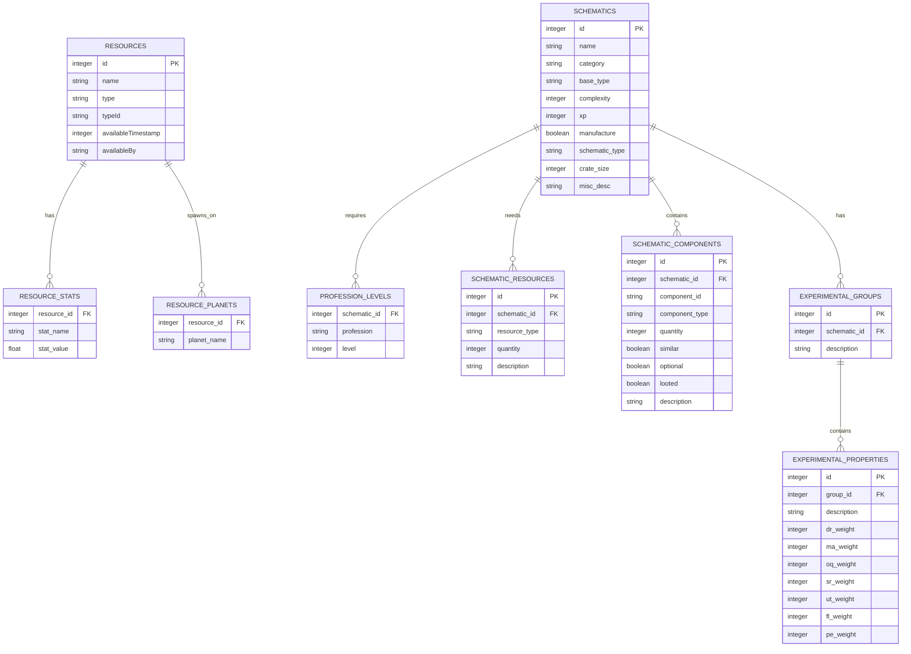
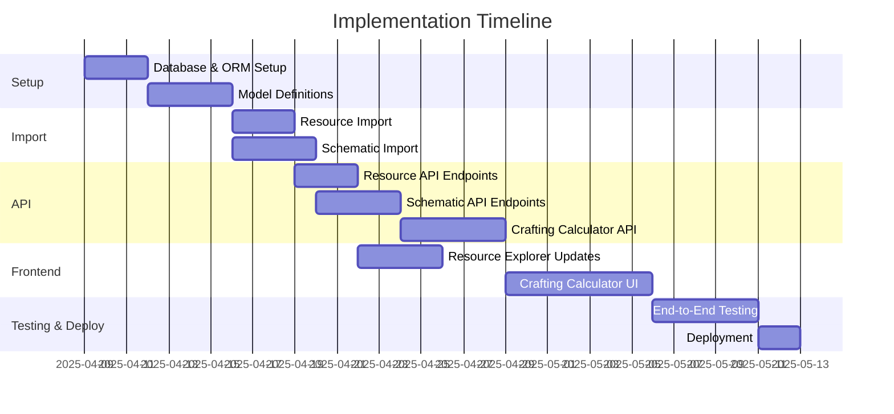

# Database Implementation Plan for SWG Resource Explorer

This document outlines the plan to migrate from XML parsing to a database-driven architecture that will handle both resources and schematics, supporting the current Resource Explorer and future Crafting Calculator features.

## Overview

The current XML-based approach will be replaced with a relational database system that provides better performance, scalability, and support for complex queries necessary for a crafting calculator. This change will also enable more efficient filtering, sorting, and data retrieval operations.

## Database Schema Design



## Implementation Timeline



## Phase 1: Database & ORM Setup (3 days)

### 1. Install Dependencies

```bash
# Core dependencies
npm install --save sequelize sqlite3 pg dotenv
npm install --save-dev sequelize-cli jest supertest

# Logging and error tracking
npm install --save winston

# XML parsing (already installed)
# npm install --save fast-xml-parser
```

### 2. Initialize Sequelize

```bash
mkdir -p server/database
cd server/database
npx sequelize-cli init
```

### 3. Configure Database Connection

Create `server/database/config/config.js`:

```javascript
require('dotenv').config({ path: process.env.NODE_ENV === 'production' ? '.env.production' : '.env.development' });

module.exports = {
  development: {
    dialect: 'sqlite',
    storage: './server/database/database.sqlite',
    logging: console.log,
    pool: {
      max: 5,
      min: 0,
      acquire: 30000,
      idle: 10000
    }
  },
  test: {
    dialect: 'sqlite',
    storage: ':memory:',
    logging: false
  },
  production: {
    dialect: 'postgres',
    host: process.env.DB_HOST,
    port: process.env.DB_PORT,
    username: process.env.DB_USER,
    password: process.env.DB_PASS,
    database: process.env.DB_NAME,
    logging: false,
    pool: {
      max: 10,
      min: 2,
      acquire: 30000,
      idle: 10000
    },
    dialectOptions: {
      ssl: {
        require: true,
        rejectUnauthorized: false
      }
    }
  }
};
```

Create environment variable files:

```bash
# .env.development
NODE_ENV=development
PORT=5000

# .env.production
NODE_ENV=production
PORT=5000
DB_HOST=your-production-host
DB_PORT=5432
DB_USER=your-db-username
DB_PASS=your-db-password
DB_NAME=swg_resources
```

## Phase 2: Model Definitions (4 days)

### 1. Create Database Models

Create the following model files in `swg-resource-explorer/server/database/models/`:

#### Resource Model (`resource.js`)

```javascript
module.exports = (sequelize, DataTypes) => {
  const Resource = sequelize.define('Resource', {
    id: {
      type: DataTypes.INTEGER,
      primaryKey: true,
      autoIncrement: false
    },
    name: {
      type: DataTypes.STRING,
      allowNull: false
    },
    type: {
      type: DataTypes.STRING,
      allowNull: false
    },
    typeId: {
      type: DataTypes.STRING,
      allowNull: false
    },
    availableTimestamp: {
      type: DataTypes.INTEGER,
      allowNull: false
    },
    availableBy: {
      type: DataTypes.STRING,
      allowNull: true
    }
  }, {
    tableName: 'resources',
    timestamps: true,
    indexes: [
      { fields: ['name'] },
      { fields: ['type'] },
      { fields: ['availableTimestamp'] }
    ]
  });

  Resource.associate = (models) => {
    Resource.hasMany(models.ResourceStat, {
      foreignKey: 'resourceId',
      as: 'stats',
      onDelete: 'CASCADE'
    });
    Resource.hasMany(models.ResourcePlanet, {
      foreignKey: 'resourceId',
      as: 'planets',
      onDelete: 'CASCADE'
    });
  };

  return Resource;
};
```

#### ResourceStat Model (`resourceStat.js`)

```javascript
module.exports = (sequelize, DataTypes) => {
  const ResourceStat = sequelize.define('ResourceStat', {
    resourceId: {
      type: DataTypes.INTEGER,
      allowNull: false,
      references: {
        model: 'resources',
        key: 'id'
      }
    },
    name: {
      type: DataTypes.STRING,
      allowNull: false
    },
    value: {
      type: DataTypes.INTEGER,
      allowNull: false
    }
  }, {
    tableName: 'resource_stats',
    timestamps: true,
    indexes: [
      { fields: ['resourceId'] },
      { fields: ['name'] },
      { fields: ['name', 'value'] }
    ]
  });

  ResourceStat.associate = (models) => {
    ResourceStat.belongsTo(models.Resource, {
      foreignKey: 'resourceId',
      as: 'resource'
    });
  };

  return ResourceStat;
};
```

#### ResourcePlanet Model (`resourcePlanet.js`)

```javascript
module.exports = (sequelize, DataTypes) => {
  const ResourcePlanet = sequelize.define('ResourcePlanet', {
    resourceId: {
      type: DataTypes.INTEGER,
      allowNull: false,
      references: {
        model: 'resources',
        key: 'id'
      }
    },
    name: {
      type: DataTypes.STRING,
      allowNull: false
    }
  }, {
    tableName: 'resource_planets',
    timestamps: true,
    indexes: [
      { fields: ['resourceId'] },
      { fields: ['name'] }
    ]
  });

  ResourcePlanet.associate = (models) => {
    ResourcePlanet.belongsTo(models.Resource, {
      foreignKey: 'resourceId',
      as: 'resource'
    });
  };

  return ResourcePlanet;
};
```

#### Schematic Model (`schematic.js`)

```javascript
module.exports = (sequelize, DataTypes) => {
  const Schematic = sequelize.define('Schematic', {
    id: {
      type: DataTypes.INTEGER,
      primaryKey: true,
      autoIncrement: false
    },
    name: {
      type: DataTypes.STRING,
      allowNull: false
    },
    category: {
      type: DataTypes.STRING,
      allowNull: true
    },
    baseType: {
      type: DataTypes.STRING,
      allowNull: true
    },
    complexity: {
      type: DataTypes.INTEGER,
      allowNull: true
    },
    xp: {
      type: DataTypes.INTEGER,
      allowNull: true
    },
    manufacture: {
      type: DataTypes.BOOLEAN,
      allowNull: true,
      defaultValue: true
    },
    schematicType: {
      type: DataTypes.STRING,
      allowNull: true
    },
    crateSize: {
      type: DataTypes.INTEGER,
      allowNull: true,
      defaultValue: 0
    },
    miscDesc: {
      type: DataTypes.TEXT,
      allowNull: true
    }
  }, {
    tableName: 'schematics',
    timestamps: true,
    indexes: [
      { fields: ['name'] },
      { fields: ['category'] }
    ]
  });

  Schematic.associate = (models) => {
    Schematic.hasMany(models.ProfessionLevel, {
      foreignKey: 'schematicId',
      as: 'professionLevels',
      onDelete: 'CASCADE'
    });
    Schematic.hasMany(models.SchematicResource, {
      foreignKey: 'schematicId',
      as: 'resources',
      onDelete: 'CASCADE'
    });
    Schematic.hasMany(models.SchematicComponent, {
      foreignKey: 'schematicId',
      as: 'components',
      onDelete: 'CASCADE'
    });
    Schematic.hasMany(models.ExperimentalGroup, {
      foreignKey: 'schematicId',
      as: 'experimentalGroups',
      onDelete: 'CASCADE'
    });
  };

  return Schematic;
};
```

#### ProfessionLevel Model (`professionLevel.js`)

```javascript
module.exports = (sequelize, DataTypes) => {
  const ProfessionLevel = sequelize.define('ProfessionLevel', {
    schematicId: {
      type: DataTypes.INTEGER,
      allowNull: false,
      references: {
        model: 'schematics',
        key: 'id'
      }
    },
    profession: {
      type: DataTypes.STRING,
      allowNull: false
    },
    level: {
      type: DataTypes.INTEGER,
      allowNull: false
    }
  }, {
    tableName: 'profession_levels',
    timestamps: true,
    indexes: [
      { fields: ['schematicId'] },
      { fields: ['profession'] }
    ]
  });

  ProfessionLevel.associate = (models) => {
    ProfessionLevel.belongsTo(models.Schematic, {
      foreignKey: 'schematicId',
      as: 'schematic'
    });
  };

  return ProfessionLevel;
};
```

#### SchematicResource Model (`schematicResource.js`)

```javascript
module.exports = (sequelize, DataTypes) => {
  const SchematicResource = sequelize.define('SchematicResource', {
    id: {
      type: DataTypes.INTEGER,
      primaryKey: true,
      autoIncrement: true
    },
    schematicId: {
      type: DataTypes.INTEGER,
      allowNull: false,
      references: {
        model: 'schematics',
        key: 'id'
      }
    },
    resourceType: {
      type: DataTypes.STRING,
      allowNull: false
    },
    quantity: {
      type: DataTypes.INTEGER,
      allowNull: false
    },
    description: {
      type: DataTypes.STRING,
      allowNull: true
    }
  }, {
    tableName: 'schematic_resources',
    timestamps: true,
    indexes: [
      { fields: ['schematicId'] },
      { fields: ['resourceType'] }
    ]
  });

  SchematicResource.associate = (models) => {
    SchematicResource.belongsTo(models.Schematic, {
      foreignKey: 'schematicId',
      as: 'schematic'
    });
  };

  return SchematicResource;
};
```

#### SchematicComponent Model (`schematicComponent.js`)

```javascript
module.exports = (sequelize, DataTypes) => {
  const SchematicComponent = sequelize.define('SchematicComponent', {
    id: {
      type: DataTypes.INTEGER,
      primaryKey: true,
      autoIncrement: true
    },
    schematicId: {
      type: DataTypes.INTEGER,
      allowNull: false,
      references: {
        model: 'schematics',
        key: 'id'
      }
    },
    componentId: {
      type: DataTypes.STRING,
      allowNull: false
    },
    componentType: {
      type: DataTypes.STRING,
      allowNull: false
    },
    quantity: {
      type: DataTypes.INTEGER,
      allowNull: false
    },
    similar: {
      type: DataTypes.BOOLEAN,
      allowNull: false,
      defaultValue: false
    },
    optional: {
      type: DataTypes.BOOLEAN,
      allowNull: false,
      defaultValue: false
    },
    looted: {
      type: DataTypes.BOOLEAN,
      allowNull: false,
      defaultValue: false
    },
    description: {
      type: DataTypes.STRING,
      allowNull: true
    }
  }, {
    tableName: 'schematic_components',
    timestamps: true,
    indexes: [
      { fields: ['schematicId'] },
      { fields: ['componentId'] },
      { fields: ['componentType'] }
    ]
  });

  SchematicComponent.associate = (models) => {
    SchematicComponent.belongsTo(models.Schematic, {
      foreignKey: 'schematicId',
      as: 'schematic'
    });
  };

  return SchematicComponent;
};
```

#### ExperimentalGroup Model (`experimentalGroup.js`)

```javascript
module.exports = (sequelize, DataTypes) => {
  const ExperimentalGroup = sequelize.define('ExperimentalGroup', {
    id: {
      type: DataTypes.INTEGER,
      primaryKey: true,
      autoIncrement: true
    },
    schematicId: {
      type: DataTypes.INTEGER,
      allowNull: false,
      references: {
        model: 'schematics',
        key: 'id'
      }
    },
    description: {
      type: DataTypes.STRING,
      allowNull: false
    }
  }, {
    tableName: 'experimental_groups',
    timestamps: true,
    indexes: [
      { fields: ['schematicId'] }
    ]
  });

  ExperimentalGroup.associate = (models) => {
    ExperimentalGroup.belongsTo(models.Schematic, {
      foreignKey: 'schematicId',
      as: 'schematic'
    });
    ExperimentalGroup.hasMany(models.ExperimentalProperty, {
      foreignKey: 'groupId',
      as: 'properties',
      onDelete: 'CASCADE'
    });
  };

  return ExperimentalGroup;
};
```

#### ExperimentalProperty Model (`experimentalProperty.js`)

```javascript
module.exports = (sequelize, DataTypes) => {
  const ExperimentalProperty = sequelize.define('ExperimentalProperty', {
    id: {
      type: DataTypes.INTEGER,
      primaryKey: true,
      autoIncrement: true
    },
    groupId: {
      type: DataTypes.INTEGER,
      allowNull: false,
      references: {
        model: 'experimental_groups',
        key: 'id'
      }
    },
    description: {
      type: DataTypes.STRING,
      allowNull: false
    },
    drWeight: {
      type: DataTypes.INTEGER,
      allowNull: true,
      defaultValue: 0
    },
    maWeight: {
      type: DataTypes.INTEGER,
      allowNull: true,
      defaultValue: 0
    },
    oqWeight: {
      type: DataTypes.INTEGER,
      allowNull: true,
      defaultValue: 0
    },
    srWeight: {
      type: DataTypes.INTEGER,
      allowNull: true,
      defaultValue: 0
    },
    utWeight: {
      type: DataTypes.INTEGER,
      allowNull: true,
      defaultValue: 0
    },
    flWeight: {
      type: DataTypes.INTEGER,
      allowNull: true,
      defaultValue: 0
    },
    peWeight: {
      type: DataTypes.INTEGER,
      allowNull: true,
      defaultValue: 0
    }
  }, {
    tableName: 'experimental_properties',
    timestamps: true,
    indexes: [
      { fields: ['groupId'] }
    ]
  });

  ExperimentalProperty.associate = (models) => {
    ExperimentalProperty.belongsTo(models.ExperimentalGroup, {
      foreignKey: 'groupId',
      as: 'group'
    });
  };

  return ExperimentalProperty;
};
```

### 2. Create Migration Files

Generate migrations for all models:

```bash
npx sequelize-cli migration:generate --name create-resources-tables
npx sequelize-cli migration:generate --name create-schematics-tables
```

Example of a complete migration file for resources:

```javascript
'use strict';

module.exports = {
  up: async (queryInterface, Sequelize) => {
    // Create resources table
    await queryInterface.createTable('resources', {
      id: {
        type: Sequelize.INTEGER,
        primaryKey: true,
        autoIncrement: false
      },
      name: {
        type: Sequelize.STRING,
        allowNull: false
      },
      type: {
        type: Sequelize.STRING,
        allowNull: false
      },
      typeId: {
        type: Sequelize.STRING,
        allowNull: false
      },
      availableTimestamp: {
        type: Sequelize.INTEGER,
        allowNull: false
      },
      availableBy: {
        type: Sequelize.STRING,
        allowNull: true
      },
      createdAt: {
        type: Sequelize.DATE,
        allowNull: false
      },
      updatedAt: {
        type: Sequelize.DATE,
        allowNull: false
      }
    });

    // Create indexes
    await queryInterface.addIndex('resources', ['name']);
    await queryInterface.addIndex('resources', ['type']);
    await queryInterface.addIndex('resources', ['availableTimestamp']);

    // Create resource_stats table
    await queryInterface.createTable('resource_stats', {
      id: {
        type: Sequelize.INTEGER,
        primaryKey: true,
        autoIncrement: true
      },
      resourceId: {
        type: Sequelize.INTEGER,
        allowNull: false,
        references: {
          model: 'resources',
          key: 'id'
        },
        onDelete: 'CASCADE'
      },
      name: {
        type: Sequelize.STRING,
        allowNull: false
      },
      value: {
        type: Sequelize.INTEGER,
        allowNull: false
      },
      createdAt: {
        type: Sequelize.DATE,
        allowNull: false
      },
      updatedAt: {
        type: Sequelize.DATE,
        allowNull: false
      }
    });

    // Create indexes
    await queryInterface.addIndex('resource_stats', ['resourceId']);
    await queryInterface.addIndex('resource_stats', ['name']);
    await queryInterface.addIndex('resource_stats', ['name', 'value']);

    // Create resource_planets table
    await queryInterface.createTable('resource_planets', {
      id: {
        type: Sequelize.INTEGER,
        primaryKey: true,
        autoIncrement: true
      },
      resourceId: {
        type: Sequelize.INTEGER,
        allowNull: false,
        references: {
          model: 'resources',
          key: 'id'
        },
        onDelete: 'CASCADE'
      },
      name: {
        type: Sequelize.STRING,
        allowNull: false
      },
      createdAt: {
        type: Sequelize.DATE,
        allowNull: false
      },
      updatedAt: {
        type: Sequelize.DATE,
        allowNull: false
      }
    });

    // Create indexes
    await queryInterface.addIndex('resource_planets', ['resourceId']);
    await queryInterface.addIndex('resource_planets', ['name']);
  },

  down: async (queryInterface, Sequelize) => {
    await queryInterface.dropTable('resource_planets');
    await queryInterface.dropTable('resource_stats');
    await queryInterface.dropTable('resources');
  }
};
```

## Phase 3: XML Importers (5 days)

### 1. Create Resource Importer

Create `swg-resource-explorer/server/utils/resourceImporter.js`:

```javascript
const fs = require('fs');
const path = require('path');
const { XMLParser } = require('fast-xml-parser');
const db = require('../database/models');

// Configure XML parser options
const parserOptions = {
  ignoreAttributes: false,
  attributeNamePrefix: '_',
  allowBooleanAttributes: true,
  parseAttributeValue: true,
  trimValues: true,
};

// Create parser instance
const parser = new XMLParser(parserOptions);

/**
 * Import resources from XML file to database
 * @param {string} filePath - Path to XML file
 */
async function importResources(filePath) {
  try {
    console.log('Starting resource import from XML...');
    const xmlData = fs.readFileSync(filePath, 'utf8');
    const parsedData = parser.parse(xmlData);
    
    // Extract resources array
    const resources = parsedData.resource_data.resources.resource;
    
    // Use transaction for data integrity
    const transaction = await db.sequelize.transaction();
    
    try {
      console.log(`Processing ${resources.length} resources...`);
      let importedCount = 0;
      
      for (const resource of resources) {
        // Create or update resource
        const [resourceRecord, created] = await db.Resource.findOrCreate({
          where: { id: resource._swgaide_id },
          defaults: {
            name: resource.name,
            type: resource.type,
            typeId: resource.swgaide_type_id,
            availableTimestamp: parseInt(resource.available_timestamp, 10),
            availableBy: resource.available_by || null
          },
          transaction
        });
        
        if (!created) {
          // Update existing record
          await resourceRecord.update({
            name: resource.name,
            type: resource.type,
            typeId: resource.swgaide_type_id,
            availableTimestamp: parseInt(resource.available_timestamp, 10),
            availableBy: resource.available_by || null
          }, { transaction });
        }
        
        // Delete existing stats and planets for update
        await db.ResourceStat.destroy({
          where: { resourceId: resourceRecord.id },
          transaction
        });
        
        await db.ResourcePlanet.destroy({
          where: { resourceId: resourceRecord.id },
          transaction
        });
        
        // Add stats
        if (resource.stats) {
          const stats = [];
          Object.entries(resource.stats).forEach(([key, value]) => {
            stats.push({
              resourceId: resourceRecord.id,
              name: key,
              value: parseInt(value, 10)
            });
          });
          
          if (stats.length > 0) {
            await db.ResourceStat.bulkCreate(stats, { transaction });
          }
        }
        
        // Add planets
        if (resource.planets && resource.planets.planet) {
          const planets = [];
          const planetArray = Array.isArray(resource.planets.planet) 
            ? resource.planets.planet 
            : [resource.planets.planet];
          
          planetArray.forEach(planet => {
            planets.push({
              resourceId: resourceRecord.id,
              name: planet.name
            });
          });
          
          if (planets.length > 0) {
            await db.ResourcePlanet.bulkCreate(planets, { transaction });
          }
        }
        
        importedCount++;
        if (importedCount % 100 === 0) {
          console.log(`Imported ${importedCount} resources...`);
        }
      }
      
      // Commit transaction
      await transaction.commit();
      console.log(`Successfully imported ${importedCount} resources`);
      return importedCount;
    } catch (error) {
      // Rollback transaction on error
      await transaction.rollback();
      console.error('Error during resource import transaction:', error);
      throw error;
    }
  } catch (error) {
    console.error('Error importing resources:', error);
    throw error;
  }
}

module.exports = { importResources };
```

### 2. Create Schematic Importer

Create `swg-resource-explorer/server/utils/schematicImporter.js`:

```javascript
const fs = require('fs');
const path = require('path');
const { XMLParser } = require('fast-xml-parser');
const db = require('../database/models');

// Configure XML parser options
const parserOptions = {
  ignoreAttributes: false,
  attributeNamePrefix: '_',
  allowBooleanAttributes: true,
  parseAttributeValue: true,
  trimValues: true,
};

// Create parser instance
const parser = new XMLParser(parserOptions);

/**
 * Import schematics from XML file to database
 * @param {string} filePath - Path to XML file
 */
async function importSchematics(filePath) {
  try {
    console.log('Starting schematic import from XML...');
    const xmlData = fs.readFileSync(filePath, 'utf8');
    const parsedData = parser.parse(xmlData);
    
    // Extract schematics array
    const schematics = parsedData.schematics.schematic;
    
    // Use transaction for data integrity
    const transaction = await db.sequelize.transaction();
    
    try {
      console.log(`Processing ${schematics.length} schematics...`);
      let importedCount = 0;
      
      for (const schematic of schematics) {
        // Create or update schematic
        const [schematicRecord, created] = await db.Schematic.findOrCreate({
          where: { id: schematic._id },
          defaults: {
            name: schematic._name,
            category: schematic._category,
            baseType: schematic._base,
            complexity: schematic.statistics?._complexity || 0,
            xp: schematic.statistics?._xp || 0,
            manufacture: schematic.statistics?._manufacture === 'yes',
            schematicType: schematic.statistics?._type || 'Regular',
            crateSize: schematic.statistics?._crate || 0,
            miscDesc: schematic.misc?._desc || ''
          },
          transaction
        });
        
        if (!created) {
          // Update existing record
          await schematicRecord.update({
            name: schematic._name,
            category: schematic._category,
            baseType: schematic._base,
            complexity: schematic.statistics?._complexity || 0,
            xp: schematic.statistics?._xp || 0,
            manufacture: schematic.statistics?._manufacture === 'yes',
            schematicType: schematic.statistics?._type || 'Regular',
            crateSize: schematic.statistics?._crate || 0,
            miscDesc: schematic.misc?._desc || ''
          }, { transaction });
        }
        
        // Delete existing relationships for update
        await db.ProfessionLevel.destroy({
          where: { schematicId: schematicRecord.id },
          transaction
        });
        
        await db.SchematicResource.destroy({
          where: { schematicId: schematicRecord.id },
          transaction
        });
        
        await db.SchematicComponent.destroy({
          where: { schematicId: schematicRecord.id },
          transaction
        });
        
        await db.ExperimentalGroup.destroy({
          where: { schematicId: schematicRecord.id },
          transaction
        });
        
        // Add profession level
        if (schematic.level) {
          await db.ProfessionLevel.create({
            schematicId: schematicRecord.id,
            profession: schematic.level._profession,
            level: schematic.level._level
          }, { transaction });
        }
        
        // Add resources
        if (schematic.resource) {
          const resources = Array.isArray(schematic.resource) 
            ? schematic.resource 
            : [schematic.resource];
          
          for (const resource of resources) {
            await db.SchematicResource.create({
              schematicId: schematicRecord.id,
              resourceType: resource._id,
              quantity: resource._units,
              description: resource._desc
            }, { transaction });
          }
        }
        
        // Add components
        if (schematic.component) {
          const components = Array.isArray(schematic.component) 
            ? schematic.component 
            : [schematic.component];
          
          for (const component of components) {
            await db.SchematicComponent.create({
              schematicId: schematicRecord.id,
              componentId: component._id,
              componentType: component._type,
              quantity: component._number,
              similar: component._similar === 'yes',
              optional: component._optional === 'yes',
              looted: component._looted === 'yes',
              description: component._desc
            }, { transaction });
          }
        }
        
        // Add experimental groups and properties
        if (schematic.exp_grp) {
          const expGroups = Array.isArray(schematic.exp_grp) 
            ? schematic.exp_grp 
            : [schematic.exp_grp];
          
          for (const expGroup of expGroups) {
            const experimentalGroup = await db.ExperimentalGroup.create({
              schematicId: schematicRecord.id,
              description: expGroup._desc
            }, { transaction });
            
            if (expGroup.exp) {
              const expProperties = Array.isArray(expGroup.exp) 
                ? expGroup.exp 
                : [expGroup.exp];
              
              for (const expProperty of expProperties) {
                await db.ExperimentalProperty.create({
                  groupId: experimentalGroup.id,
                  description: expProperty._desc,
                  drWeight: expProperty._dr || 0,
                  maWeight: expProperty._ma || 0,
                  oqWeight: expProperty._oq || 0,
                  srWeight: expProperty._sr || 0,
                  utWeight: expProperty._ut || 0,
                  flWeight: expProperty._fl || 0,
                  peWeight: expProperty._pe || 0
                }, { transaction });
              }
            }
          }
        }
        
        importedCount++;
        if (importedCount % 100 === 0) {
          console.log(`Imported ${importedCount} schematics...`);
        }
      }
      
      // Commit transaction
      await transaction.commit();
      console.log(`Successfully imported ${importedCount} schematics`);
      return importedCount;
    } catch (error) {
      // Rollback transaction on error
      await transaction.rollback();
      console.error('Error during schematic import transaction:', error);
      throw error;
    }
  } catch (error) {
    console.error('Error importing schematics:', error);
    throw error;
  }
}

module.exports = { importSchematics };
```

### 3. Create Import Script

Create `swg-resource-explorer/server/utils/importData.js`:

```javascript
const path = require('path');
const { importResources } = require('./resourceImporter');
const { importSchematics } = require('./schematicImporter');
const db = require('../database/models');

// File paths
const RESOURCES_XML_PATH = path.resolve(__dirname, '../../../currentresources_168.xml');
const SCHEMATICS_XML_PATH = path.resolve(__dirname, '../../../schematics_unity.xml');

/**
 * Run full data import
 */
async function runImport() {
  try {
    console.log('Starting database sync...');
    await db.sequelize.sync();
    
    console.log('Importing resources...');
    const resourceCount = await importResources(RESOURCES_XML_PATH);
    
    console.log('Importing schematics...');
    const schematicCount = await importSchematics(SCHEMATICS_XML_PATH);
    
    console.log(`Import complete. Imported ${resourceCount} resources and ${schematicCount} schematics.`);
    return { resourceCount, schematicCount };
  } catch (error) {
    console.error('Import failed:', error);
    throw error;
  }
}

// If called directly (not imported)
if (require.main === module) {
  runImport()
    .then(() => process.exit(0))
    .catch(err => {
      console.error(err);
      process.exit(1);
    });
} else {
  module.exports = { runImport };
}
```

## Phase 4: API Development (7 days)

### 1. Update Resource Routes

Create `server/routes/resources.js` to use the database instead of XML parsing:

```javascript
const express = require('express');
const { Op } = require('sequelize');
const db = require('../database/models');
const { validateResourceQuery } = require('../utils/validators');
const logger = require('../utils/logger');

const router = express.Router();

// Get all resources with filtering and pagination
router.get('/', async (req, res) => {
  try {
    // Validate and sanitize query parameters
    const { error, value } = validateResourceQuery(req.query);
    if (error) {
      return res.status(400).json({ error: error.details[0].message });
    }
    
    const { name, type, planet, page = 1, limit = 50, ...statFilters } = value;
    
    // Build query conditions
    const whereConditions = {};
    const include = [];
    
    // Name filter
    if (name) {
      whereConditions.name = { [Op.like]: `%${name}%` };
    }
    
    // Type filter
    if (type) {
      whereConditions.type = { [Op.like]: `%${type}%` };
    }
    
    // Planet filter
    if (planet) {
      include.push({
        model: db.ResourcePlanet,
        as: 'planets',
        where: {
          name: { [Op.like]: `%${planet}%` }
        },
        required: true
      });
    } else {
      include.push({
        model: db.ResourcePlanet,
        as: 'planets'
      });
    }
    
    // Stats filters
    const statConditions = [];
    const statFiltersMapping = {
      min_dr: { name: 'dr', op: Op.gte },
      max_dr: { name: 'dr', op: Op.lte },
      min_ma: { name: 'ma', op: Op.gte },
      max_ma: { name: 'ma', op: Op.lte },
      min_oq: { name: 'oq', op: Op.gte },
      max_oq: { name: 'oq', op: Op.lte },
      min_sr: { name: 'sr', op: Op.gte },
      max_sr: { name: 'sr', op: Op.lte },
      min_ut: { name: 'ut', op: Op.gte },
      max_ut: { name: 'ut', op: Op.lte },
      min_fl: { name: 'fl', op: Op.gte },
      max_fl: { name: 'fl', op: Op.lte },
      min_pe: { name: 'pe', op: Op.gte },
      max_pe: { name: 'pe', op: Op.lte }
    };
    
    Object.entries(statFilters).forEach(([filter, value]) => {
      if (statFiltersMapping[filter]) {
        const { name, op } = statFiltersMapping[filter];
        
        statConditions.push({
          model: db.ResourceStat,
          as: 'stats',
          where: {
            name: name,
            value: { [op]: value }
          },
          required: true
        });
      }
    });
    
    if (statConditions.length > 0) {
      include.push(...statConditions);
    } else {
      include.push({
        model: db.ResourceStat,
        as: 'stats'
      });
    }
    
    // Pagination
    const offset = (page - 1) * limit;
    
    // Execute query
    const { count, rows } = await db.Resource.findAndCountAll({
      where: whereConditions,
      include,
      distinct: true,
      limit,
      offset,
      order: [['availableTimestamp', 'DESC']]
    });
    
    // Format response
    const resources = rows.map(resource => {
      const stats = {};
      resource.stats.forEach(stat => {
        stats[stat.name] = stat.value;
      });
      
      const planets = resource.planets.map(planet => planet.name);
      
      return {
        id: resource.id,
        name: resource.name,
        type: resource.type,
        typeId: resource.typeId,
        availableTimestamp: resource.availableTimestamp,
        availableBy: resource.availableBy,
        stats,
        planets
      };
    });
    
    res.json({
      total: count,
      page: parseInt(page, 10),
      limit: parseInt(limit, 10),
      resources
    });
  } catch (error) {
    logger.error('Error fetching resources:', error);
    res.status(500).json({ error: 'Failed to fetch resources' });
  }
});

// Get resource categories
router.get('/categories', async (req, res) => {
  try {
    // Fetch all resources
    const resources = await db.Resource.findAll({
      attributes: ['type']
    });
    
    // Process categories
    const categories = {};
    const planetTypes = {};
    
    resources.forEach(resource => {
      const fullType = resource.type;
      const parts = fullType.split(' ');
      
      // Assume first word is planet-specific prefix
      const planetPrefix = parts[0];
      const baseType = parts.slice(1).join(' ');
      
      // Group by base type
      if (!categories[baseType]) {
        categories[baseType] = [];
      }
      
      if (!categories[baseType].includes(fullType)) {
        categories[baseType].push(fullType);
      }
      
      // Track planet-specific types
      if (!planetTypes[planetPrefix]) {
        planetTypes[planetPrefix] = [];
      }
      
      if (!planetTypes[planetPrefix].includes(baseType)) {
        planetTypes[planetPrefix].push(baseType);
      }
    });
    
    res.json({ categories, planetTypes });
  } catch (error) {
    logger.error('Error fetching categories:', error);
    res.status(500).json({ error: 'Failed to fetch categories' });
  }
});

// Get resource by ID
router.get('/:id', async (req, res) => {
  try {
    const resourceId = parseInt(req.params.id, 10);
    
    const resource = await db.Resource.findByPk(resourceId, {
      include: [
        { model: db.ResourceStat, as: 'stats' },
        { model: db.ResourcePlanet, as: 'planets' }
      ]
    });
    
    if (!resource) {
      return res.status(404).json({ error: 'Resource not found' });
    }
    
    // Format response
    const stats = {};
    resource.stats.forEach(stat => {
      stats[stat.name] = stat.value;
    });
    
    const planets = resource.planets.map(planet => planet.name);
    
    res.json({
      id: resource.id,
      name: resource.name,
      type: resource.type,
      typeId: resource.typeId,
      availableTimestamp: resource.availableTimestamp,
      availableBy: resource.availableBy,
      stats,
      planets
    });
  } catch (error) {
    logger.error('Error fetching resource:', error);
    res.status(500).json({ error: 'Failed to fetch resource' });
  }
});

module.exports = router;
```

### 2. Create Schematic Routes

Create `server/routes/schematics.js` for schematic API endpoints:

```javascript
const express = require('express');
const { Op } = require('sequelize');
const db = require('../database/models');
const logger = require('../utils/logger');

const router = express.Router();

// Get all schematics with filtering and pagination
router.get('/', async (req, res) => {
  try {
    const {
      name,
      category,
      profession,
      resource_type,
      page = 1,
      limit = 50
    } = req.query;
    
    // Build query conditions
    const whereConditions = {};
    const include = [];
    
    // Name filter
    if (name) {
      whereConditions.name = { [Op.like]: `%${name}%` };
    }
    
    // Category filter
    if (category) {
      whereConditions.category = { [Op.like]: `%${category}%` };
    }
    
    // Profession filter
    if (profession) {
      include.push({
        model: db.ProfessionLevel,
        as: 'professionLevels',
        where: {
          profession: { [Op.like]: `%${profession}%` }
        },
        required: true
      });
    } else {
      include.push({
        model: db.ProfessionLevel,
        as: 'professionLevels'
      });
    }
    
    // Resource type filter
    if (resource_type) {
      include.push({
        model: db.SchematicResource,
        as: 'resources',
        where: {
          resourceType: { [Op.like]: `%${resource_type}%` }
        },
        required: true
      });
    } else {
      include.push({
        model: db.SchematicResource,
        as: 'resources'
      });
    }
    
    // Always include components and experimental groups
    include.push({
      model: db.SchematicComponent,
      as: 'components'
    });
    
    include.push({
      model: db.ExperimentalGroup,
      as: 'experimentalGroups',
      include: [{
        model: db.ExperimentalProperty,
        as: 'properties'
      }]
    });
    
    // Pagination
    const offset = (page - 1) * limit;
    
    // Execute query
    const { count, rows } = await db.Schematic.findAndCountAll({
      where: whereConditions,
      include,
      distinct: true,
      limit,
      offset,
      order: [['name', 'ASC']]
    });
    
    res.json({
      total: count,
      page: parseInt(page, 10),
      limit: parseInt(limit, 10),
      schematics: rows
    });
  } catch (error) {
    logger.error('Error fetching schematics:', error);
    res.status(500).json({ error: 'Failed to fetch schematics' });
  }
});

// Get schematic categories
router.get('/categories', async (req, res) => {
  try {
    const categories = await db.Schematic.findAll({
      attributes: ['category'],
      group: ['category'],
      raw: true
    });
    
    const professions = await db.ProfessionLevel.findAll({
      attributes: ['profession'],
      group: ['profession'],
      raw: true
    });
    
    res.json({
      categories: categories.map(c => c.category),
      professions: professions.map(p => p.profession)
    });
  } catch (error) {
    logger.error('Error fetching schematic categories:', error);
    res.status(500).json({ error: 'Failed to fetch schematic categories' });
  }
});

// Get schematic by ID
router.get('/:id', async (req, res) => {
  try {
    const schematicId = parseInt(req.params.id, 10);
    
    const schematic = await db.Schematic.findByPk(schematicId, {
      include: [
        { model: db.ProfessionLevel, as: 'professionLevels' },
        { model: db.SchematicResource, as: 'resources' },
        { model: db.SchematicComponent, as: 'components' },
        {
          model: db.ExperimentalGroup,
          as: 'experimentalGroups',
          include: [{
            model: db.ExperimentalProperty,
            as: 'properties'
          }]
        }
      ]
    });
    
    if (!schematic) {
      return res.status(404).json({ error: 'Schematic not found' });
    }
    
    res.json(schematic);
  } catch (error) {
    logger.error('Error fetching schematic:', error);
    res.status(500).json({ error: 'Failed to fetch schematic' });
  }
});

module.exports = router;
```

### 3. Create Crafting Calculator API

Create `server/routes/calculator.js` for crafting calculator functionality:

```javascript
const express = require('express');
const { Op } = require('sequelize');
const db = require('../database/models');
const logger = require('../utils/logger');

const router = express.Router();

// Calculate best resources for a schematic
router.post('/calculate', async (req, res) => {
  try {
    const { schematicId, experimentFocus } = req.body;
    
    if (!schematicId) {
      return res.status(400).json({ error: 'Schematic ID is required' });
    }
    
    // Get schematic with experimental properties
    const schematic = await db.Schematic.findByPk(schematicId, {
      include: [
        {
          model: db.SchematicResource,
          as: 'resources'
        },
        {
          model: db.ExperimentalGroup,
          as: 'experimentalGroups',
          include: [{
            model: db.ExperimentalProperty,
            as: 'properties'
          }]
        }
      ]
    });
    
    if (!schematic) {
      return res.status(404).json({ error: 'Schematic not found' });
    }
    
    // Get all resources needed for this schematic
    const resourceTypes = schematic.resources.map(r => r.resourceType);
    
    // Get all available resources of the required types
    const availableResources = await db.Resource.findAll({
      where: {
        type: { [Op.in]: resourceTypes }
      },
      include: [
        { model: db.ResourceStat, as: 'stats' },
        { model: db.ResourcePlanet, as: 'planets' }
      ]
    });
    
    // Format resources by type
    const resourcesByType = {};
    availableResources.forEach(resource => {
      const type = resource.type;
      if (!resourcesByType[type]) {
        resourcesByType[type] = [];
      }
      
      // Format stats for easier calculation
      const stats = {};
      resource.stats.forEach(stat => {
        stats[stat.name] = stat.value;
      });
      
      const planets = resource.planets.map(planet => planet.name);
      
      resourcesByType[type].push({
        id: resource.id,
        name: resource.name,
        type: resource.type,
        stats,
        planets
      });
    });
    
    // Calculate optimal resources based on experimental focus
    const calculationResults = calculateOptimalResources(
      schematic,
      resourcesByType,
      experimentFocus
    );
    
    res.json(calculationResults);
  } catch (error) {
    logger.error('Error calculating resources:', error);
    res.status(500).json({ error: 'Failed to calculate resources' });
  }
});

/**
 * Calculate optimal resources for a schematic based on experimental focus
 * @param {Object} schematic - Schematic data
 * @param {Object} resourcesByType - Available resources grouped by type
 * @param {String} experimentFocus - Experimental property to focus on
 * @returns {Object} - Calculation results
 */
function calculateOptimalResources(schematic, resourcesByType, experimentFocus) {
  // Implementation of resource calculation algorithm
  // This is a placeholder - the actual implementation would be more complex
  
  const results = {
    schematicId: schematic.id,
    schematicName: schematic.name,
    experimentFocus: experimentFocus || 'balanced',
    resourceRecommendations: []
  };
  
  // For each required resource type
  schematic.resources.forEach(requiredResource => {
    const resourceType = requiredResource.resourceType;
    const availableOfType = resourcesByType[resourceType] || [];
    
    if (availableOfType.length === 0) {
      results.resourceRecommendations.push({
        resourceType,
        quantity: requiredResource.quantity,
        recommended: null,
        message: 'No resources of this type available'
      });
      return;
    }
    
    // Find the best resource based on experimental weight
    let bestResource = null;
    let bestScore = -1;
    
    availableOfType.forEach(resource => {
      const score = calculateResourceScore(
        resource,
        schematic.experimentalGroups,
        experimentFocus
      );
      
      if (score > bestScore) {
        bestScore = score;
        bestResource = resource;
      }
    });
    
    results.resourceRecommendations.push({
      resourceType,
      quantity: requiredResource.quantity,
      recommended: bestResource,
      score: bestScore
    });
  });
  
  return results;
}

/**
 * Calculate a score for a resource based on experimental properties
 * @param {Object} resource - Resource data with stats
 * @param {Array} experimentalGroups - Experimental groups with properties
 * @param {String} focus - Experimental property to focus on
 * @returns {Number} - Score (0-1000)
 */
function calculateResourceScore(resource, experimentalGroups, focus) {
  // Implementation of resource scoring algorithm
  // This is a placeholder - the actual implementation would be more complex
  
  let totalScore = 0;
  let weightCount = 0;
  
  // Calculate weighted score based on experimental properties
  experimentalGroups.forEach(group => {
    group.properties.forEach(property => {
      Object.entries(resource.stats).forEach(([statName, statValue]) => {
        // Get the weight for this stat from the property
        const weightKey = `${statName}Weight`;
        const weight = property[weightKey] || 0;
        
        if (weight > 0) {
          // If focused on this property, double its weight
          const focusMultiplier = (focus && property.description === focus) ? 2 : 1;
          
          // Calculate weighted score component
          totalScore += (statValue * weight * focusMultiplier);
          weightCount += (weight * focusMultiplier);
        }
      });
    });
  });
  
  // Normalize score (0-1000)
  return weightCount > 0 ? (totalScore / weightCount) : 0;
}

module.exports = router;
```

### 4. Update Server.js

Modify the main server file to include the new database initialization and routes:

```javascript
const express = require('express');
const cors = require('cors');
const path = require('path');
const db = require('./database/models');
const logger = require('./utils/logger');

// Routes
const resourceRoutes = require('./routes/resources');
const schematicRoutes = require('./routes/schematics');
const calculatorRoutes = require('./routes/calculator');

const app = express();
const PORT = process.env.PORT || 5000;

// Middleware
app.use(cors());
app.use(express.json());

// Database connection
db.sequelize.authenticate()
  .then(() => {
    logger.info('Database connection established successfully.');
  })
  .catch(err => {
    logger.error('Unable to connect to the database:', err);
  });

// API Routes
app.use('/api/resources', resourceRoutes);
app.use('/api/schematics', schematicRoutes);
app.use('/api/calculator', calculatorRoutes);

// API Documentation
app.use('/api-docs', express.static(path.join(__dirname, 'docs')));

// Error handling middleware
app.use((err, req, res, next) => {
  logger.error(err.stack);
  res.status(500).json({
    error: 'Internal Server Error',
    message: process.env.NODE_ENV === 'development' ? err.message : undefined
  });
});

// Serve static assets in production
if (process.env.NODE_ENV === 'production') {
  app.use(express.static(path.join(__dirname, '../build')));
  
  app.get('*', (req, res) => {
    res.sendFile(path.resolve(__dirname, '../build', 'index.html'));
  });
}

// Start server
app.listen(PORT, () => {
  logger.info(`Server running on port ${PORT}`);
});

module.exports = app; // Export for testing
```

## Phase 5: Frontend Integration (8 days)

### 1. Update API Client

Expand `swg-resource-explorer/src/utils/api.ts` to include schematic and calculator endpoints.

### 2. Add Type Definitions

Create type definitions for schematics and crafting calculations.

### 3. Create Frontend Components for Crafting Calculator

Develop React components for the crafting calculator:
1. Schematic browser
2. Schematic detail view
3. Resource calculator
4. Component visualization

## Phase 6: Testing & Deployment (7 days)

### 1. Create Test Cases

Create `server/tests/resource.test.js` for testing resource API:

```javascript
const request = require('supertest');
const app = require('../server');
const db = require('../database/models');

describe('Resource API', () => {
  beforeAll(async () => {
    // Setup test database and seed with test data
    await db.sequelize.sync({ force: true });
    
    // Insert test resources
    await db.Resource.bulkCreate([
      {
        id: 1,
        name: 'Test Resource 1',
        type: 'Naboo Iron',
        typeId: 'iron_naboo',
        availableTimestamp: Math.floor(Date.now() / 1000) - 86400,
        availableBy: 'tester'
      },
      {
        id: 2,
        name: 'Test Resource 2',
        type: 'Tatooine Copper',
        typeId: 'copper_tatooine',
        availableTimestamp: Math.floor(Date.now() / 1000) - 172800,
        availableBy: 'tester'
      }
    ]);
    
    // Insert stats
    await db.ResourceStat.bulkCreate([
      { resourceId: 1, name: 'dr', value: 500 },
      { resourceId: 1, name: 'ma', value: 600 },
      { resourceId: 1, name: 'oq', value: 700 },
      { resourceId: 2, name: 'dr', value: 300 },
      { resourceId: 2, name: 'ma', value: 800 },
      { resourceId: 2, name: 'oq', value: 400 }
    ]);
    
    // Insert planets
    await db.ResourcePlanet.bulkCreate([
      { resourceId: 1, name: 'Naboo' },
      { resourceId: 2, name: 'Tatooine' }
    ]);
  });
  
  afterAll(async () => {
    await db.sequelize.close();
  });
  
  test('GET /api/resources should return resources with pagination', async () => {
    const res = await request(app).get('/api/resources');
    
    expect(res.statusCode).toBe(200);
    expect(res.body.total).toBe(2);
    expect(res.body.resources.length).toBe(2);
  });
  
  test('GET /api/resources with filters should return filtered resources', async () => {
    const res = await request(app).get('/api/resources?name=Test%20Resource%201');
    
    expect(res.statusCode).toBe(200);
    expect(res.body.total).toBe(1);
    expect(res.body.resources[0].name).toBe('Test Resource 1');
  });
  
  test('GET /api/resources/:id should return a single resource', async () => {
    const res = await request(app).get('/api/resources/1');
    
    expect(res.statusCode).toBe(200);
    expect(res.body.id).toBe(1);
    expect(res.body.name).toBe('Test Resource 1');
    expect(res.body.stats).toBeDefined();
    expect(res.body.planets).toBeDefined();
  });
  
  test('GET /api/resources/:id with invalid ID should return 404', async () => {
    const res = await request(app).get('/api/resources/999');
    
    expect(res.statusCode).toBe(404);
  });
});
```

Create similar test files for schematics and calculator APIs.

### 2. Database Migration Script

Create a deployment script `server/scripts/deploy.js`:

```javascript
const { execSync } = require('child_process');
const path = require('path');
const fs = require('fs');
const dotenv = require('dotenv');

// Load environment variables
dotenv.config({ path: '.env.production' });

// Configuration
const DB_BACKUP_PATH = path.resolve(__dirname, '../backups');
const MIGRATIONS_PATH = path.resolve(__dirname, '../database/migrations');

// Create backups directory if it doesn't exist
if (!fs.existsSync(DB_BACKUP_PATH)) {
  fs.mkdirSync(DB_BACKUP_PATH, { recursive: true });
}

// Functions
function runCommand(command) {
  console.log(`Running: ${command}`);
  try {
    execSync(command, { stdio: 'inherit' });
  } catch (error) {
    console.error(`Command failed: ${command}`);
    throw error;
  }
}

function createBackup() {
  if (process.env.NODE_ENV !== 'production') {
    console.log('Creating SQLite backup...');
    const timestamp = new Date().toISOString().replace(/[:.]/g, '-');
    const backupFile = path.join(DB_BACKUP_PATH, `database-${timestamp}.sqlite`);
    fs.copyFileSync(
      path.resolve(__dirname, '../database/database.sqlite'),
      backupFile
    );
    console.log(`Backup created: ${backupFile}`);
  } else {
    console.log('Creating PostgreSQL backup...');
    const timestamp = new Date().toISOString().replace(/[:.]/g, '-');
    const backupFile = path.join(DB_BACKUP_PATH, `database-${timestamp}.sql`);
    runCommand(`pg_dump -h ${process.env.DB_HOST} -U ${process.env.DB_USER} -d ${process.env.DB_NAME} -f ${backupFile}`);
    console.log(`Backup created: ${backupFile}`);
  }
}

function runMigrations() {
  console.log('Running database migrations...');
  runCommand('npx sequelize-cli db:migrate');
}

function importData() {
  console.log('Importing data...');
  runCommand('node server/utils/importData.js');
}

// Main deployment process
async function deploy() {
  try {
    console.log('Starting deployment process...');
    
    // Create backup
    createBackup();
    
    // Run migrations
    runMigrations();
    
    // Import data if needed
    importData();
    
    console.log('Deployment completed successfully');
  } catch (error) {
    console.error('Deployment failed:', error);
    process.exit(1);
  }
}

// Run deployment
deploy();
```

### 3. Deployment Documentation

Create `docs/deployment.md`:

```markdown
# Deployment Guide

This document outlines the steps required to deploy the SWG Resource Explorer application in a production environment.

## Prerequisites

- Node.js 16+ and npm 8+
- PostgreSQL 12+ (for production)
- Git

## Environment Setup

1. Clone the repository:

```bash
git clone https://github.com/yourusername/swg-resource-explorer.git
cd swg-resource-explorer
```

2. Create environment variables file:

```bash
cp .env.example .env.production
```

3. Edit `.env.production` and set the following variables:

```
NODE_ENV=production
PORT=5000
DB_HOST=your-postgres-host
DB_PORT=5432
DB_USER=your-db-username
DB_PASS=your-db-password
DB_NAME=swg_resources
```

## Database Setup

1. Install dependencies:

```bash
npm install
```

2. Create the database:

```bash
createdb -h $DB_HOST -U $DB_USER swg_resources
```

3. Run migrations and import data:

```bash
npm run deploy
```

## Application Deployment

### Option 1: Standard Server

1. Build the frontend:

```bash
npm run build
```

2. Start the server:

```bash
npm start
```

### Option 2: Docker Deployment

1. Build Docker image:

```bash
docker build -t swg-resource-explorer .
```

2. Run the container:

```bash
docker run -d -p 5000:5000 --name swg-explorer --env-file .env.production swg-resource-explorer
```

### Option 3: Cloud Deployment (Heroku)

1. Install Heroku CLI:

```bash
npm install -g heroku
```

2. Create Heroku app:

```bash
heroku create swg-resource-explorer
```

3. Add PostgreSQL addon:

```bash
heroku addons:create heroku-postgresql:hobby-dev
```

4. Set environment variables:

```bash
heroku config:set NODE_ENV=production
```

5. Deploy:

```bash
git push heroku main
```

## Maintenance

### Database Backups

Automated backups are created before each migration. To manually create a backup:

```bash
node server/scripts/backup.js
```

### Updates

To update the application:

1. Pull the latest changes:

```bash
git pull origin main
```

2. Update dependencies:

```bash
npm install
```

3. Run deployment script:

```bash
npm run deploy
```

4. Restart the server:

```bash
npm restart
```

## Monitoring

The application logs are written to:

- Console output
- `logs/app.log` file (rotated daily)

Use a monitoring service like PM2, New Relic, or Datadog for production monitoring.
```

## Implementation Schedule

This implementation can be completed in approximately 4-6 weeks, with the following milestones:

1. **Week 1**: Database setup, model definitions, and initial importers
2. **Week 2**: Complete importers and API development
3. **Week 3-4**: Frontend integration and crafting calculator
4. **Week 5**: Testing, refinement, and documentation
5. **Week 6**: Deployment and monitoring

## Benefits

1. **Improved Performance**: Optimized database queries with proper indexing, more efficient than XML parsing
2. **Better Scalability**: Handles growing data and complexity efficiently with connection pooling and resource management
3. **Enhanced Filtering**: More powerful filtering capabilities with SQL-based queries
4. **Crafting Calculator**: Foundation for complex crafting calculations that would be difficult with XML processing
5. **Persistent Storage**: Data survives server restarts and can be backed up and restored
6. **Future Growth**: Structured foundation for new features with clear relationships between entities
7. **Improved Testing**: Easier to test and validate with database transactions that can be rolled back
8. **Better Error Handling**: Comprehensive error tracking and logging throughout the application
9. **Environment Flexibility**: Development in SQLite for simplicity, production in PostgreSQL for power
10. **API Consistency**: Standardized API responses and error handling across all endpoints

## Next Steps After Implementation

1. **Performance Monitoring**: Set up metrics to track database performance
2. **Caching Layer**: Add Redis caching for frequently accessed data
3. **API Documentation**: Create comprehensive API documentation with Swagger/OpenAPI
4. **User Authentication**: Implement authentication for write operations
5. **Real-time Updates**: Add WebSocket support for real-time resource updates