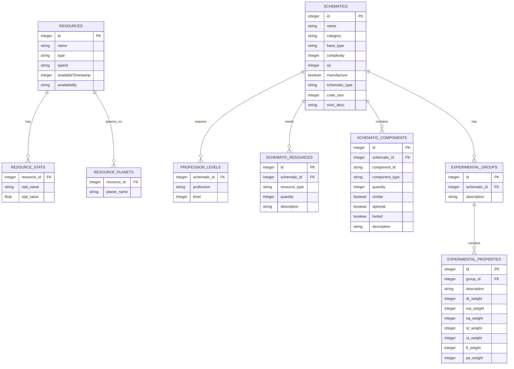
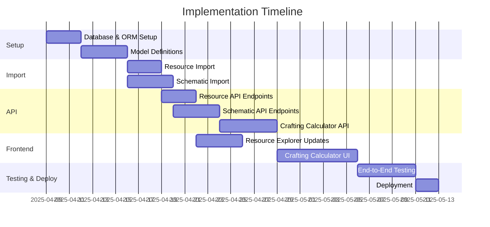

# Database Implementation Plan for SWG Resource Explorer

This document outlines the plan to migrate from XML parsing to a database-driven architecture that will handle both resources and schematics, supporting the current Resource Explorer and future Crafting Calculator features.

## Overview

The current XML-based approach will be replaced with a relational database system that provides better performance, scalability, and support for complex queries necessary for a crafting calculator.

## Database Schema Design



## Implementation Timeline



## Phase 1: Database & ORM Setup (3 days)

### 1. Install Dependencies

```bash
# Core dependencies
npm install --save sequelize sqlite3 pg
npm install --save-dev sequelize-cli

# XML parsing (already installed)
# npm install --save fast-xml-parser
```

### 2. Initialize Sequelize

```bash
mkdir -p swg-resource-explorer/server/database
cd swg-resource-explorer/server/database
npx sequelize-cli init
```

### 3. Configure Database Connection

Create `swg-resource-explorer/server/database/config/config.js`:

```javascript
module.exports = {
  development: {
    dialect: 'sqlite',
    storage: './server/database/database.sqlite',
    logging: console.log,
  },
  production: {
    dialect: 'postgres',
    host: process.env.DB_HOST,
    port: process.env.DB_PORT,
    username: process.env.DB_USER,
    password: process.env.DB_PASS,
    database: process.env.DB_NAME,
    logging: false,
  }
};
```

## Phase 2: Model Definitions (4 days)

### 1. Create Database Models

Create the following model files in `swg-resource-explorer/server/database/models/`:

#### Resource Model (`resource.js`)

```javascript
module.exports = (sequelize, DataTypes) => {
  const Resource = sequelize.define('Resource', {
    id: {
      type: DataTypes.INTEGER,
      primaryKey: true,
      autoIncrement: false
    },
    name: {
      type: DataTypes.STRING,
      allowNull: false
    },
    type: {
      type: DataTypes.STRING,
      allowNull: false
    },
    typeId: {
      type: DataTypes.STRING,
      allowNull: false
    },
    availableTimestamp: {
      type: DataTypes.INTEGER,
      allowNull: false
    },
    availableBy: {
      type: DataTypes.STRING,
      allowNull: true
    }
  }, {
    tableName: 'resources',
    timestamps: true,
    indexes: [
      { fields: ['name'] },
      { fields: ['type'] },
      { fields: ['availableTimestamp'] }
    ]
  });

  Resource.associate = (models) => {
    Resource.hasMany(models.ResourceStat, {
      foreignKey: 'resourceId',
      as: 'stats',
      onDelete: 'CASCADE'
    });
    Resource.hasMany(models.ResourcePlanet, {
      foreignKey: 'resourceId',
      as: 'planets',
      onDelete: 'CASCADE'
    });
  };

  return Resource;
};
```

#### ResourceStat Model (`resourceStat.js`)

```javascript
module.exports = (sequelize, DataTypes) => {
  const ResourceStat = sequelize.define('ResourceStat', {
    resourceId: {
      type: DataTypes.INTEGER,
      allowNull: false,
      references: {
        model: 'resources',
        key: 'id'
      }
    },
    name: {
      type: DataTypes.STRING,
      allowNull: false
    },
    value: {
      type: DataTypes.INTEGER,
      allowNull: false
    }
  }, {
    tableName: 'resource_stats',
    timestamps: true,
    indexes: [
      { fields: ['resourceId'] },
      { fields: ['name'] },
      { fields: ['name', 'value'] }
    ]
  });

  ResourceStat.associate = (models) => {
    ResourceStat.belongsTo(models.Resource, {
      foreignKey: 'resourceId',
      as: 'resource'
    });
  };

  return ResourceStat;
};
```

#### ResourcePlanet Model (`resourcePlanet.js`)

```javascript
module.exports = (sequelize, DataTypes) => {
  const ResourcePlanet = sequelize.define('ResourcePlanet', {
    resourceId: {
      type: DataTypes.INTEGER,
      allowNull: false,
      references: {
        model: 'resources',
        key: 'id'
      }
    },
    name: {
      type: DataTypes.STRING,
      allowNull: false
    }
  }, {
    tableName: 'resource_planets',
    timestamps: true,
    indexes: [
      { fields: ['resourceId'] },
      { fields: ['name'] }
    ]
  });

  ResourcePlanet.associate = (models) => {
    ResourcePlanet.belongsTo(models.Resource, {
      foreignKey: 'resourceId',
      as: 'resource'
    });
  };

  return ResourcePlanet;
};
```

#### Schematic Model (`schematic.js`)

```javascript
module.exports = (sequelize, DataTypes) => {
  const Schematic = sequelize.define('Schematic', {
    id: {
      type: DataTypes.INTEGER,
      primaryKey: true,
      autoIncrement: false
    },
    name: {
      type: DataTypes.STRING,
      allowNull: false
    },
    category: {
      type: DataTypes.STRING,
      allowNull: true
    },
    baseType: {
      type: DataTypes.STRING,
      allowNull: true
    },
    complexity: {
      type: DataTypes.INTEGER,
      allowNull: true
    },
    xp: {
      type: DataTypes.INTEGER,
      allowNull: true
    },
    manufacture: {
      type: DataTypes.BOOLEAN,
      allowNull: true,
      defaultValue: true
    },
    schematicType: {
      type: DataTypes.STRING,
      allowNull: true
    },
    crateSize: {
      type: DataTypes.INTEGER,
      allowNull: true,
      defaultValue: 0
    },
    miscDesc: {
      type: DataTypes.TEXT,
      allowNull: true
    }
  }, {
    tableName: 'schematics',
    timestamps: true,
    indexes: [
      { fields: ['name'] },
      { fields: ['category'] }
    ]
  });

  Schematic.associate = (models) => {
    Schematic.hasMany(models.ProfessionLevel, {
      foreignKey: 'schematicId',
      as: 'professionLevels',
      onDelete: 'CASCADE'
    });
    Schematic.hasMany(models.SchematicResource, {
      foreignKey: 'schematicId',
      as: 'resources',
      onDelete: 'CASCADE'
    });
    Schematic.hasMany(models.SchematicComponent, {
      foreignKey: 'schematicId',
      as: 'components',
      onDelete: 'CASCADE'
    });
    Schematic.hasMany(models.ExperimentalGroup, {
      foreignKey: 'schematicId',
      as: 'experimentalGroups',
      onDelete: 'CASCADE'
    });
  };

  return Schematic;
};
```

#### ProfessionLevel Model (`professionLevel.js`)

```javascript
module.exports = (sequelize, DataTypes) => {
  const ProfessionLevel = sequelize.define('ProfessionLevel', {
    schematicId: {
      type: DataTypes.INTEGER,
      allowNull: false,
      references: {
        model: 'schematics',
        key: 'id'
      }
    },
    profession: {
      type: DataTypes.STRING,
      allowNull: false
    },
    level: {
      type: DataTypes.INTEGER,
      allowNull: false
    }
  }, {
    tableName: 'profession_levels',
    timestamps: true,
    indexes: [
      { fields: ['schematicId'] },
      { fields: ['profession'] }
    ]
  });

  ProfessionLevel.associate = (models) => {
    ProfessionLevel.belongsTo(models.Schematic, {
      foreignKey: 'schematicId',
      as: 'schematic'
    });
  };

  return ProfessionLevel;
};
```

#### SchematicResource Model (`schematicResource.js`)

```javascript
module.exports = (sequelize, DataTypes) => {
  const SchematicResource = sequelize.define('SchematicResource', {
    id: {
      type: DataTypes.INTEGER,
      primaryKey: true,
      autoIncrement: true
    },
    schematicId: {
      type: DataTypes.INTEGER,
      allowNull: false,
      references: {
        model: 'schematics',
        key: 'id'
      }
    },
    resourceType: {
      type: DataTypes.STRING,
      allowNull: false
    },
    quantity: {
      type: DataTypes.INTEGER,
      allowNull: false
    },
    description: {
      type: DataTypes.STRING,
      allowNull: true
    }
  }, {
    tableName: 'schematic_resources',
    timestamps: true,
    indexes: [
      { fields: ['schematicId'] },
      { fields: ['resourceType'] }
    ]
  });

  SchematicResource.associate = (models) => {
    SchematicResource.belongsTo(models.Schematic, {
      foreignKey: 'schematicId',
      as: 'schematic'
    });
  };

  return SchematicResource;
};
```

#### SchematicComponent Model (`schematicComponent.js`)

```javascript
module.exports = (sequelize, DataTypes) => {
  const SchematicComponent = sequelize.define('SchematicComponent', {
    id: {
      type: DataTypes.INTEGER,
      primaryKey: true,
      autoIncrement: true
    },
    schematicId: {
      type: DataTypes.INTEGER,
      allowNull: false,
      references: {
        model: 'schematics',
        key: 'id'
      }
    },
    componentId: {
      type: DataTypes.STRING,
      allowNull: false
    },
    componentType: {
      type: DataTypes.STRING,
      allowNull: false
    },
    quantity: {
      type: DataTypes.INTEGER,
      allowNull: false
    },
    similar: {
      type: DataTypes.BOOLEAN,
      allowNull: false,
      defaultValue: false
    },
    optional: {
      type: DataTypes.BOOLEAN,
      allowNull: false,
      defaultValue: false
    },
    looted: {
      type: DataTypes.BOOLEAN,
      allowNull: false,
      defaultValue: false
    },
    description: {
      type: DataTypes.STRING,
      allowNull: true
    }
  }, {
    tableName: 'schematic_components',
    timestamps: true,
    indexes: [
      { fields: ['schematicId'] },
      { fields: ['componentId'] },
      { fields: ['componentType'] }
    ]
  });

  SchematicComponent.associate = (models) => {
    SchematicComponent.belongsTo(models.Schematic, {
      foreignKey: 'schematicId',
      as: 'schematic'
    });
  };

  return SchematicComponent;
};
```

#### ExperimentalGroup Model (`experimentalGroup.js`)

```javascript
module.exports = (sequelize, DataTypes) => {
  const ExperimentalGroup = sequelize.define('ExperimentalGroup', {
    id: {
      type: DataTypes.INTEGER,
      primaryKey: true,
      autoIncrement: true
    },
    schematicId: {
      type: DataTypes.INTEGER,
      allowNull: false,
      references: {
        model: 'schematics',
        key: 'id'
      }
    },
    description: {
      type: DataTypes.STRING,
      allowNull: false
    }
  }, {
    tableName: 'experimental_groups',
    timestamps: true,
    indexes: [
      { fields: ['schematicId'] }
    ]
  });

  ExperimentalGroup.associate = (models) => {
    ExperimentalGroup.belongsTo(models.Schematic, {
      foreignKey: 'schematicId',
      as: 'schematic'
    });
    ExperimentalGroup.hasMany(models.ExperimentalProperty, {
      foreignKey: 'groupId',
      as: 'properties',
      onDelete: 'CASCADE'
    });
  };

  return ExperimentalGroup;
};
```

#### ExperimentalProperty Model (`experimentalProperty.js`)

```javascript
module.exports = (sequelize, DataTypes) => {
  const ExperimentalProperty = sequelize.define('ExperimentalProperty', {
    id: {
      type: DataTypes.INTEGER,
      primaryKey: true,
      autoIncrement: true
    },
    groupId: {
      type: DataTypes.INTEGER,
      allowNull: false,
      references: {
        model: 'experimental_groups',
        key: 'id'
      }
    },
    description: {
      type: DataTypes.STRING,
      allowNull: false
    },
    drWeight: {
      type: DataTypes.INTEGER,
      allowNull: true,
      defaultValue: 0
    },
    maWeight: {
      type: DataTypes.INTEGER,
      allowNull: true,
      defaultValue: 0
    },
    oqWeight: {
      type: DataTypes.INTEGER,
      allowNull: true,
      defaultValue: 0
    },
    srWeight: {
      type: DataTypes.INTEGER,
      allowNull: true,
      defaultValue: 0
    },
    utWeight: {
      type: DataTypes.INTEGER,
      allowNull: true,
      defaultValue: 0
    },
    flWeight: {
      type: DataTypes.INTEGER,
      allowNull: true,
      defaultValue: 0
    },
    peWeight: {
      type: DataTypes.INTEGER,
      allowNull: true,
      defaultValue: 0
    }
  }, {
    tableName: 'experimental_properties',
    timestamps: true,
    indexes: [
      { fields: ['groupId'] }
    ]
  });

  ExperimentalProperty.associate = (models) => {
    ExperimentalProperty.belongsTo(models.ExperimentalGroup, {
      foreignKey: 'groupId',
      as: 'group'
    });
  };

  return ExperimentalProperty;
};
```

### 2. Create Migration Files

Generate migrations for all models:

```bash
npx sequelize-cli migration:generate --name create-resources-tables
npx sequelize-cli migration:generate --name create-schematics-tables
```

## Phase 3: XML Importers (5 days)

### 1. Create Resource Importer

Create `swg-resource-explorer/server/utils/resourceImporter.js`:

```javascript
const fs = require('fs');
const path = require('path');
const { XMLParser } = require('fast-xml-parser');
const db = require('../database/models');

// Configure XML parser options
const parserOptions = {
  ignoreAttributes: false,
  attributeNamePrefix: '_',
  allowBooleanAttributes: true,
  parseAttributeValue: true,
  trimValues: true,
};

// Create parser instance
const parser = new XMLParser(parserOptions);

/**
 * Import resources from XML file to database
 * @param {string} filePath - Path to XML file
 */
async function importResources(filePath) {
  try {
    console.log('Starting resource import from XML...');
    const xmlData = fs.readFileSync(filePath, 'utf8');
    const parsedData = parser.parse(xmlData);
    
    // Extract resources array
    const resources = parsedData.resource_data.resources.resource;
    
    // Use transaction for data integrity
    const transaction = await db.sequelize.transaction();
    
    try {
      console.log(`Processing ${resources.length} resources...`);
      let importedCount = 0;
      
      for (const resource of resources) {
        // Create or update resource
        const [resourceRecord, created] = await db.Resource.findOrCreate({
          where: { id: resource._swgaide_id },
          defaults: {
            name: resource.name,
            type: resource.type,
            typeId: resource.swgaide_type_id,
            availableTimestamp: parseInt(resource.available_timestamp, 10),
            availableBy: resource.available_by || null
          },
          transaction
        });
        
        if (!created) {
          // Update existing record
          await resourceRecord.update({
            name: resource.name,
            type: resource.type,
            typeId: resource.swgaide_type_id,
            availableTimestamp: parseInt(resource.available_timestamp, 10),
            availableBy: resource.available_by || null
          }, { transaction });
        }
        
        // Delete existing stats and planets for update
        await db.ResourceStat.destroy({
          where: { resourceId: resourceRecord.id },
          transaction
        });
        
        await db.ResourcePlanet.destroy({
          where: { resourceId: resourceRecord.id },
          transaction
        });
        
        // Add stats
        if (resource.stats) {
          const stats = [];
          Object.entries(resource.stats).forEach(([key, value]) => {
            stats.push({
              resourceId: resourceRecord.id,
              name: key,
              value: parseInt(value, 10)
            });
          });
          
          if (stats.length > 0) {
            await db.ResourceStat.bulkCreate(stats, { transaction });
          }
        }
        
        // Add planets
        if (resource.planets && resource.planets.planet) {
          const planets = [];
          const planetArray = Array.isArray(resource.planets.planet) 
            ? resource.planets.planet 
            : [resource.planets.planet];
          
          planetArray.forEach(planet => {
            planets.push({
              resourceId: resourceRecord.id,
              name: planet.name
            });
          });
          
          if (planets.length > 0) {
            await db.ResourcePlanet.bulkCreate(planets, { transaction });
          }
        }
        
        importedCount++;
        if (importedCount % 100 === 0) {
          console.log(`Imported ${importedCount} resources...`);
        }
      }
      
      // Commit transaction
      await transaction.commit();
      console.log(`Successfully imported ${importedCount} resources`);
      return importedCount;
    } catch (error) {
      // Rollback transaction on error
      await transaction.rollback();
      console.error('Error during resource import transaction:', error);
      throw error;
    }
  } catch (error) {
    console.error('Error importing resources:', error);
    throw error;
  }
}

module.exports = { importResources };
```

### 2. Create Schematic Importer

Create `swg-resource-explorer/server/utils/schematicImporter.js`:

```javascript
const fs = require('fs');
const path = require('path');
const { XMLParser } = require('fast-xml-parser');
const db = require('../database/models');

// Configure XML parser options
const parserOptions = {
  ignoreAttributes: false,
  attributeNamePrefix: '_',
  allowBooleanAttributes: true,
  parseAttributeValue: true,
  trimValues: true,
};

// Create parser instance
const parser = new XMLParser(parserOptions);

/**
 * Import schematics from XML file to database
 * @param {string} filePath - Path to XML file
 */
async function importSchematics(filePath) {
  try {
    console.log('Starting schematic import from XML...');
    const xmlData = fs.readFileSync(filePath, 'utf8');
    const parsedData = parser.parse(xmlData);
    
    // Extract schematics array
    const schematics = parsedData.schematics.schematic;
    
    // Use transaction for data integrity
    const transaction = await db.sequelize.transaction();
    
    try {
      console.log(`Processing ${schematics.length} schematics...`);
      let importedCount = 0;
      
      for (const schematic of schematics) {
        // Create or update schematic
        const [schematicRecord, created] = await db.Schematic.findOrCreate({
          where: { id: schematic._id },
          defaults: {
            name: schematic._name,
            category: schematic._category,
            baseType: schematic._base,
            complexity: schematic.statistics?._complexity || 0,
            xp: schematic.statistics?._xp || 0,
            manufacture: schematic.statistics?._manufacture === 'yes',
            schematicType: schematic.statistics?._type || 'Regular',
            crateSize: schematic.statistics?._crate || 0,
            miscDesc: schematic.misc?._desc || ''
          },
          transaction
        });
        
        if (!created) {
          // Update existing record
          await schematicRecord.update({
            name: schematic._name,
            category: schematic._category,
            baseType: schematic._base,
            complexity: schematic.statistics?._complexity || 0,
            xp: schematic.statistics?._xp || 0,
            manufacture: schematic.statistics?._manufacture === 'yes',
            schematicType: schematic.statistics?._type || 'Regular',
            crateSize: schematic.statistics?._crate || 0,
            miscDesc: schematic.misc?._desc || ''
          }, { transaction });
        }
        
        // Delete existing relationships for update
        await db.ProfessionLevel.destroy({
          where: { schematicId: schematicRecord.id },
          transaction
        });
        
        await db.SchematicResource.destroy({
          where: { schematicId: schematicRecord.id },
          transaction
        });
        
        await db.SchematicComponent.destroy({
          where: { schematicId: schematicRecord.id },
          transaction
        });
        
        await db.ExperimentalGroup.destroy({
          where: { schematicId: schematicRecord.id },
          transaction
        });
        
        // Add profession level
        if (schematic.level) {
          await db.ProfessionLevel.create({
            schematicId: schematicRecord.id,
            profession: schematic.level._profession,
            level: schematic.level._level
          }, { transaction });
        }
        
        // Add resources
        if (schematic.resource) {
          const resources = Array.isArray(schematic.resource) 
            ? schematic.resource 
            : [schematic.resource];
          
          for (const resource of resources) {
            await db.SchematicResource.create({
              schematicId: schematicRecord.id,
              resourceType: resource._id,
              quantity: resource._units,
              description: resource._desc
            }, { transaction });
          }
        }
        
        // Add components
        if (schematic.component) {
          const components = Array.isArray(schematic.component) 
            ? schematic.component 
            : [schematic.component];
          
          for (const component of components) {
            await db.SchematicComponent.create({
              schematicId: schematicRecord.id,
              componentId: component._id,
              componentType: component._type,
              quantity: component._number,
              similar: component._similar === 'yes',
              optional: component._optional === 'yes',
              looted: component._looted === 'yes',
              description: component._desc
            }, { transaction });
          }
        }
        
        // Add experimental groups and properties
        if (schematic.exp_grp) {
          const expGroups = Array.isArray(schematic.exp_grp) 
            ? schematic.exp_grp 
            : [schematic.exp_grp];
          
          for (const expGroup of expGroups) {
            const experimentalGroup = await db.ExperimentalGroup.create({
              schematicId: schematicRecord.id,
              description: expGroup._desc
            }, { transaction });
            
            if (expGroup.exp) {
              const expProperties = Array.isArray(expGroup.exp) 
                ? expGroup.exp 
                : [expGroup.exp];
              
              for (const expProperty of expProperties) {
                await db.ExperimentalProperty.create({
                  groupId: experimentalGroup.id,
                  description: expProperty._desc,
                  drWeight: expProperty._dr || 0,
                  maWeight: expProperty._ma || 0,
                  oqWeight: expProperty._oq || 0,
                  srWeight: expProperty._sr || 0,
                  utWeight: expProperty._ut || 0,
                  flWeight: expProperty._fl || 0,
                  peWeight: expProperty._pe || 0
                }, { transaction });
              }
            }
          }
        }
        
        importedCount++;
        if (importedCount % 100 === 0) {
          console.log(`Imported ${importedCount} schematics...`);
        }
      }
      
      // Commit transaction
      await transaction.commit();
      console.log(`Successfully imported ${importedCount} schematics`);
      return importedCount;
    } catch (error) {
      // Rollback transaction on error
      await transaction.rollback();
      console.error('Error during schematic import transaction:', error);
      throw error;
    }
  } catch (error) {
    console.error('Error importing schematics:', error);
    throw error;
  }
}

module.exports = { importSchematics };
```

### 3. Create Import Script

Create `swg-resource-explorer/server/utils/importData.js`:

```javascript
const path = require('path');
const { importResources } = require('./resourceImporter');
const { importSchematics } = require('./schematicImporter');
const db = require('../database/models');

// File paths
const RESOURCES_XML_PATH = path.resolve(__dirname, '../../../currentresources_168.xml');
const SCHEMATICS_XML_PATH = path.resolve(__dirname, '../../../schematics_unity.xml');

/**
 * Run full data import
 */
async function runImport() {
  try {
    console.log('Starting database sync...');
    await db.sequelize.sync();
    
    console.log('Importing resources...');
    const resourceCount = await importResources(RESOURCES_XML_PATH);
    
    console.log('Importing schematics...');
    const schematicCount = await importSchematics(SCHEMATICS_XML_PATH);
    
    console.log(`Import complete. Imported ${resourceCount} resources and ${schematicCount} schematics.`);
    return { resourceCount, schematicCount };
  } catch (error) {
    console.error('Import failed:', error);
    throw error;
  }
}

// If called directly (not imported)
if (require.main === module) {
  runImport()
    .then(() => process.exit(0))
    .catch(err => {
      console.error(err);
      process.exit(1);
    });
} else {
  module.exports = { runImport };
}
```

## Phase 4: API Development (7 days)

### 1. Update Resource Routes

Modify `swg-resource-explorer/server/routes/resources.js` to use the database instead of XML parsing.

### 2. Create Schematic Routes

Create `swg-resource-explorer/server/routes/schematics.js` for schematic API endpoints.

### 3. Create Crafting Calculator API

Create `swg-resource-explorer/server/routes/calculator.js` for crafting calculator functionality.

### 4. Update Server.js

Modify the main server file to include the new routes and database initialization.

## Phase 5: Frontend Integration (8 days)

### 1. Update API Client

Expand `swg-resource-explorer/src/utils/api.ts` to include schematic and calculator endpoints.

### 2. Add Type Definitions

Create type definitions for schematics and crafting calculations.

### 3. Create Frontend Components for Crafting Calculator

Develop React components for the crafting calculator:
1. Schematic browser
2. Schematic detail view
3. Resource calculator
4. Component visualization

## Phase 6: Testing & Deployment (7 days)

### 1. Create Test Cases

Develop unit and integration tests for all components.

### 2. Database Migration Script

Create scripts for production database setup and migrations.

### 3. Deployment Documentation

Document the deployment process and requirements.

## Implementation Schedule

This implementation can be completed in approximately 4-6 weeks, with the following milestones:

1. **Week 1**: Database setup, model definitions, and initial importers
2. **Week 2**: Complete importers and API development
3. **Week 3-4**: Frontend integration and crafting calculator
4. **Week 5**: Testing, refinement, and documentation
5. **Week 6**: Deployment and monitoring

## Benefits

1. **Improved Performance**: Optimized database queries with proper indexing
2. **Better Scalability**: Handles growing data and complexity efficiently
3. **Enhanced Filtering**: More powerful filtering capabilities
4. **Crafting Calculator**: Foundation for complex crafting calculations
5. **Persistent Storage**: Data survives server restarts
6. **Future Growth**: Structured foundation for new features